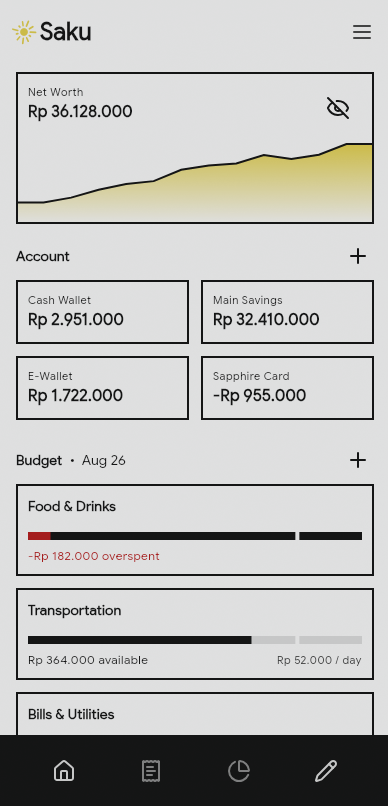
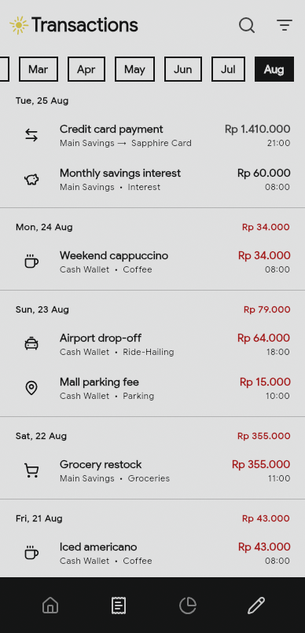
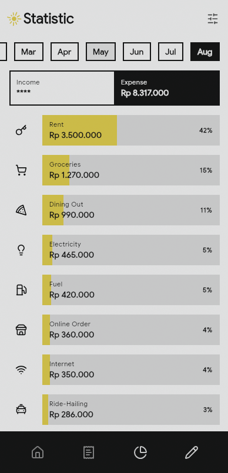
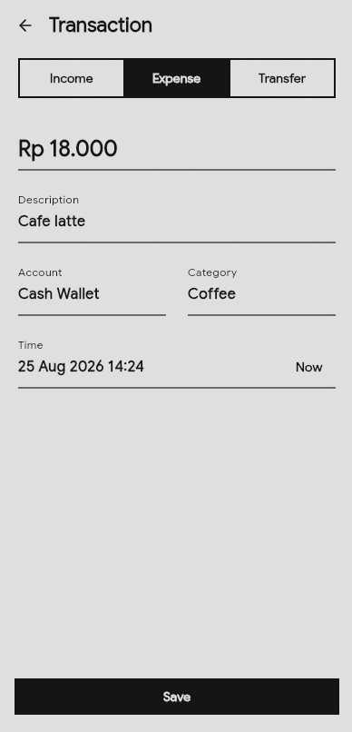

# Saku

Saku is an expense tracker app built with Kotlin Multiplatform (KMP).

## Motivation

I developed Saku as personal finance app to record my expenses and manage my spending budget better. I used to track my cash flow in Google Sheets, but it quickly grew complex and tedious. I also wanted to record expenses on the go, and internet connectivity isn't always reliable. While similar apps already exist on the Play Store, after trying a few, none felt quite right for my preferences. I was looking for something simple to use with a nice UI and minimal gimmicks. So I decided to build it myself. In a way, this project also serves as a learning medium to explore KMP in depth and build a production-grade app. 

## Features

- Manage all your transaction records locally on your device
- Set and monitor monthly spending limits for every category
- Track credit card payments and installment plans effortlessly
- Save frequent transactions as templates for quick logging
- Analyze your spending habits with detailed monthly statistics

## UI/UX

The UI theme is heavily inspired by [Minna No Ginko](https://play.google.com/store/apps/details?id=com.MinnaNoGinko.bankapp), a Japanese banking app. I love its flat, monochromatic style and bold shapes that contrasts with the bright yellow accent. For the app's content, I aim for medium information density so users can view enough at a glance without things feeling cramped. Since this is an app meant for frequent use, I try to keep animations to a minimum to keep things fast and productive, especially during the transaction creation flow.

    
    
    
    

## Tech Stack

- Kotlin Multiplatform
- Compose Multiplatform
- SQLite (via Room)
- DataStore

## Architecture

This project uses standard MVVM and the repository pattern with manual dependency injection. The logic is split across the usual 3 layers:

1. `data`: manages data persistence
2. `domain`: implements pure business logic
3. `presentation`: handles UI and navigation

The `data` and `domain` layers are implemented in the `shared` module so they can be easily reused across platforms.

## Supported Platforms

- Desktop (JVM)
- Android
- iOS (soon!)

## Build & Run

You can run the project with either:
1. Android Studio / IntelliJ IDEA
2. The provided scripts
    - Desktop build with hot reload: `./run_desktop_hot.sh`
    - Android build: `./run_android.sh`

## Future Plans

- [ ] Data export to CSV
- [ ] Recurring transactions
- [ ] Multiple currencies support
- [ ] Language settings
- [ ] iOS support